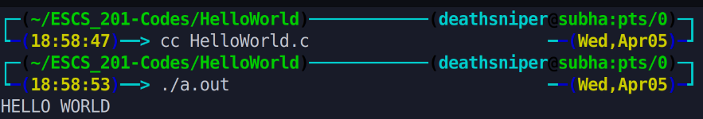

This program simply prints the message "HELLO WORLD" on the console. It demonstrates the basic structure of a C program, including the inclusion of the standard input/output library and the definition of the main function. When executed, it displays the message and then terminates.

# Output >>>>>>

