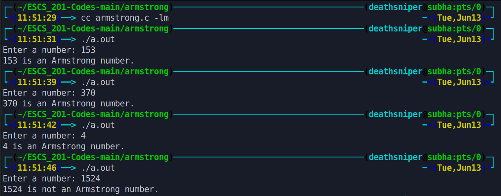

## Armstrong Number :

A positive integer of n digits is called an Armstrong number of order n (order is the number of digits) if. 

        abc.. = pow(a,n) + pow(b,n) + pow(c,n) + ..
 

# Output >>>>>>

