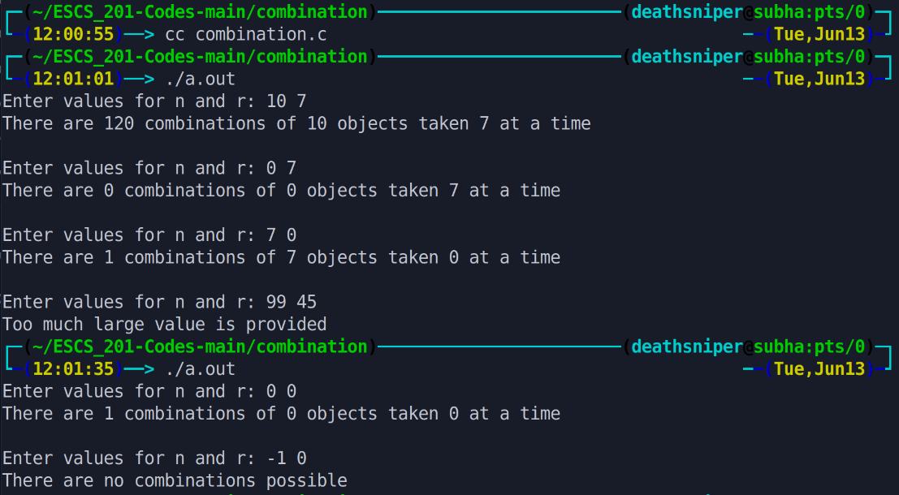

This program calculates the number of combinations of selecting 'r' objects from a set of 'n' objects using the factorial formula. It takes input for 'n' and 'r' from the user, validates the input, and outputs the calculated combinations. It repeats this process until negative values or values greater than 21 are entered.

# Output >>>>>>

