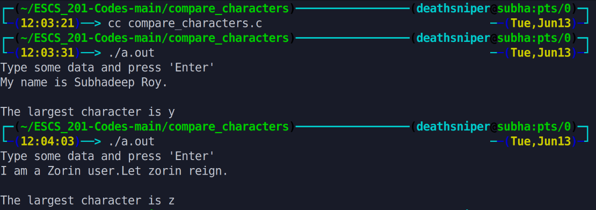

This program reads a line of data from the user and finds the largest character in the input. It continuously compares each character with the current largest character and updates it if a larger character is found. Finally, it outputs the largest character.

# Output >>>>>>

