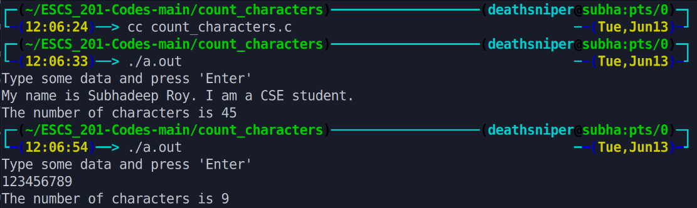

This program counts the number of characters in a line of input entered by the user. It continuously reads characters until it encounters a newline character ('\n') indicating the end of the line. It increments a counter variable `numChars` with each character read. Finally, it outputs the total number of characters in the input line.

# Output >>>>>>

