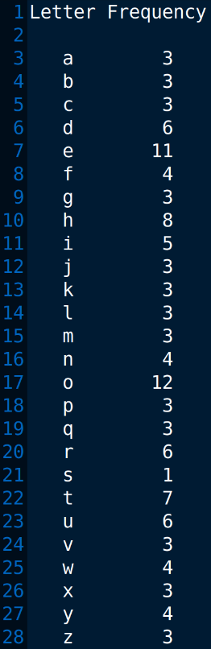

This program reads input from a file, counts the frequency of each letter (case-insensitive), and outputs the results to another file. It uses an array `letterCount` to keep track of the frequencies. The `position()` function is used to determine the position (index) of a letter in the array based on its ASCII value.

# Output >>>>>>

