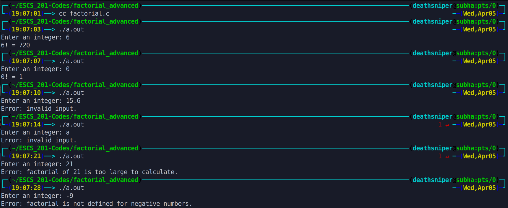

This program calculates the factorial of a non-negative integer entered by the user. It uses a loop to multiply the numbers from 2 to the given integer to compute the factorial. It includes error handling to handle negative numbers and cases where the factorial exceeds the range of the data type. The resulting factorial is then printed to the console.

# Output >>>>>>

