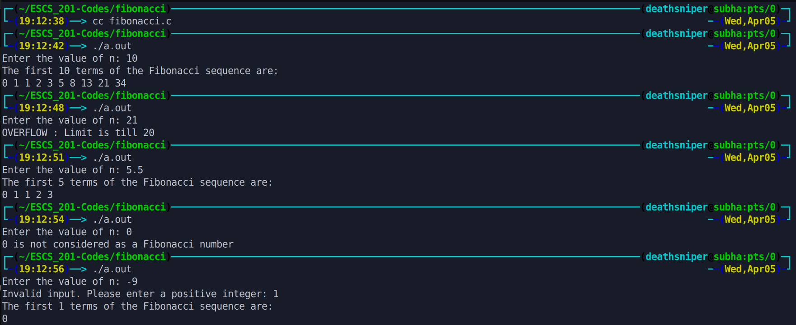

This program prints the first `n` terms of the Fibonacci sequence. The user is prompted to enter a positive integer `n`. The program then generates and displays the Fibonacci sequence up to the `n`th term. It also includes checks for invalid input and a limit of `20` terms to prevent potential integer overflow.

# Output >>>>>>

