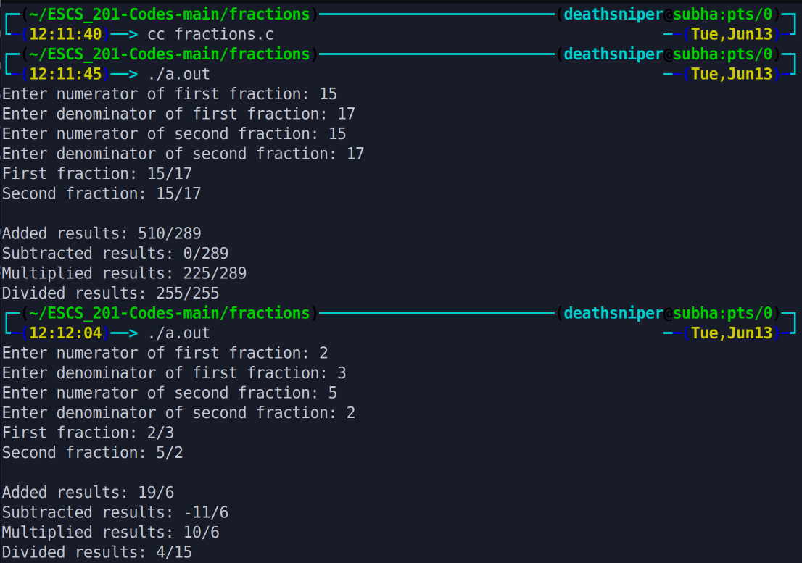

This program performs basic arithmetic operations (addition, subtraction, multiplication, and division) on fractions. The user is prompted to enter two fractions, each consisting of a numerator and a denominator. The program then calculates and displays the results of adding, subtracting, multiplying, and dividing the two fractions.

# Output >>>>>>

