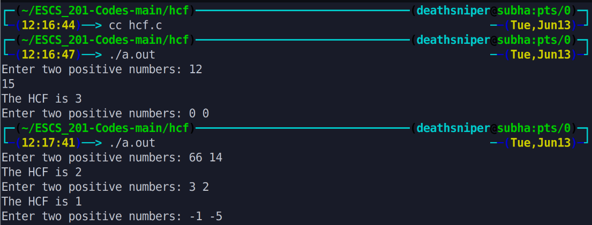

This program calculates the highest common factor (HCF) of two positive numbers. The user is prompted to enter two positive numbers, and the program calculates and displays the HCF using the Euclidean algorithm. The process repeats until the user enters non-positive numbers, at which point the program terminates.

# Output >>>>>>

