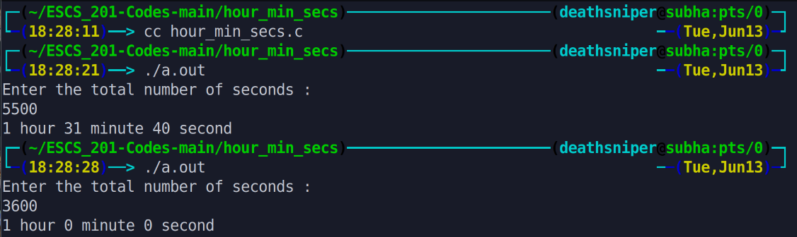

The program allows the user to enter a total number of seconds and converts it into hours, minutes, and seconds. It uses integer division and modulus operations to calculate the respective values. Finally, it displays the converted time in the format of hours, minutes, and seconds.

# Output >>>>>>

