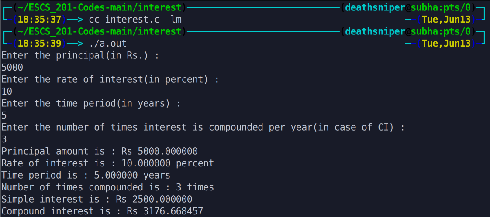

The program calculates the simple interest (SI) and compound interest (CI) based on the given principal amount, interest rate, time period, and the number of times interest is compounded per year. It uses the formulas

        SI = (P * R * T) / 100 
        CI = P * (1 + (R / N))^N*T - P

where P is the principal amount, R is the interest rate, T is the time period, and N is the number of times interest is compounded per year. It then displays the calculated SI and CI.

# Output >>>>>>

