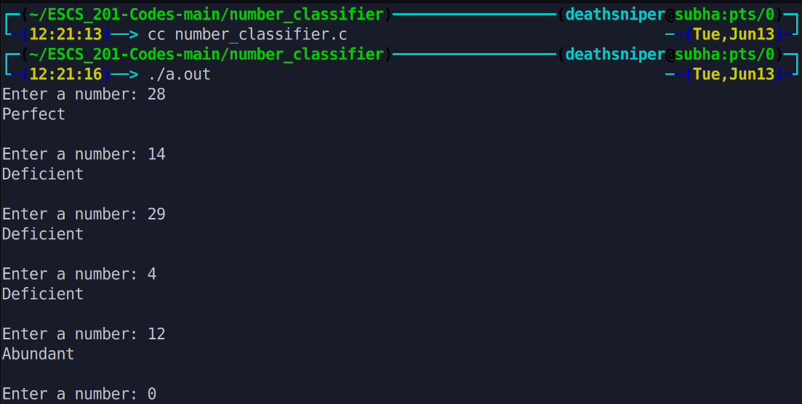

This program determines whether a given number is deficient, perfect, or abundant. It takes an input number, calculates the sum of its proper divisors, and compares it to the number itself. If the sum is less than the number, it is considered deficient. If the sum is equal to the number, it is perfect. If the sum is greater than the number, it is abundant. The program continues to prompt for new numbers until the input is zero.

# Output >>>>>>

