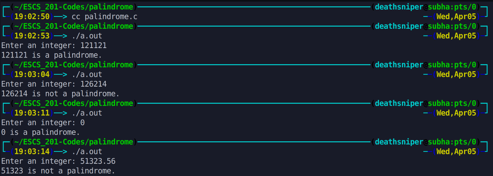

This program checks whether a given number is a palindrome or not. It takes an input number, reverses its digits, and compares it to the original number. If the reversed number is equal to the original number, it is considered a palindrome. The program then prints whether the number is a palindrome or not.

# Output >>>>>>

