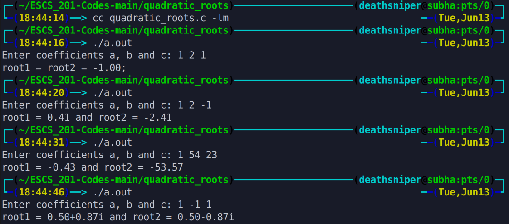

The program calculates the roots of a quadratic equation by taking coefficients a, b, and c as input from the user. It computes the discriminant and then applies different conditions to determine whether the roots are real and different, real and equal, or complex. Finally, it displays the roots based on the calculated values.

# Output >>>>>>

