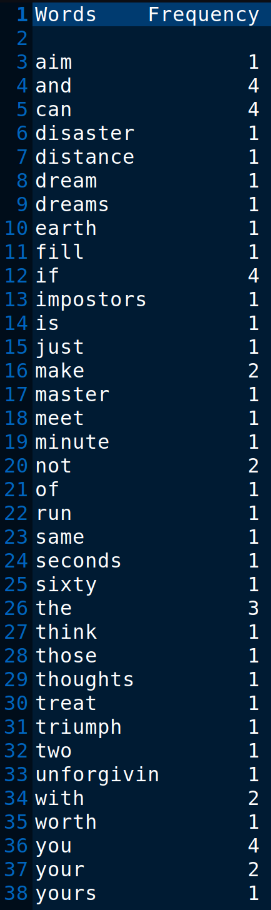

This program reads words from a file and performs word frequency analysis. It reads words from an input file, stores them in an array, and keeps track of their frequency. It uses binary search to find the appropriate position to insert new words in the array. Finally, it outputs the words and their frequencies to an output file.

# Output >>>>>>

